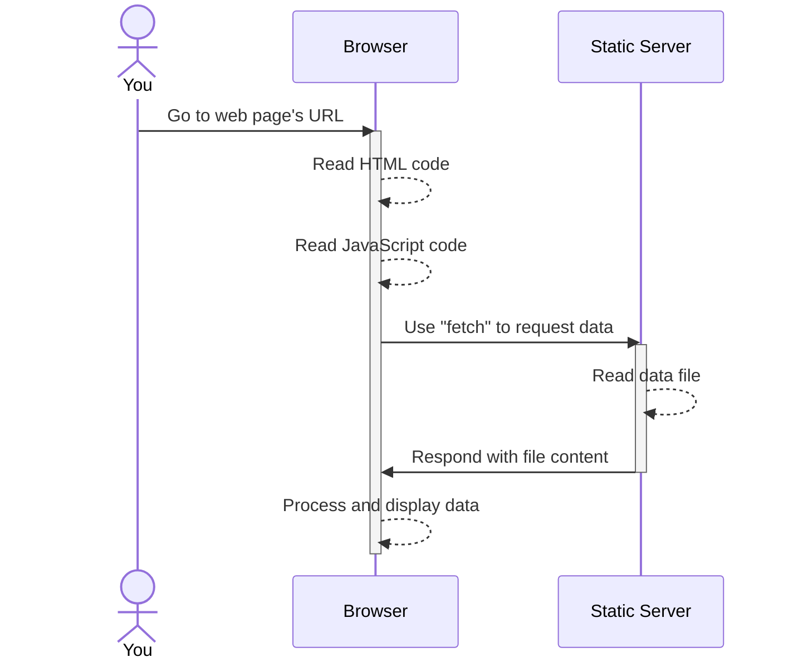
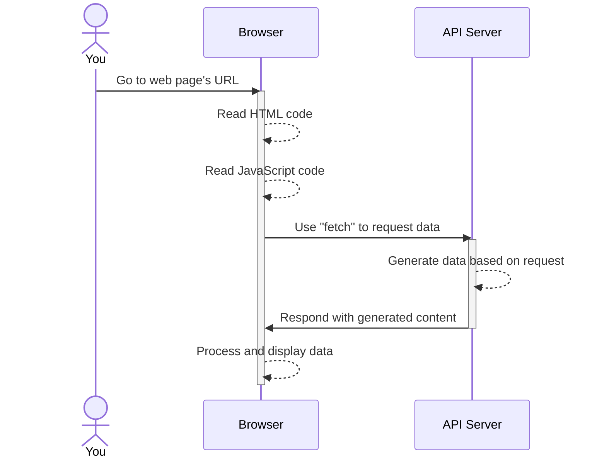

# Review

## Requesting data using `fetch`

_index.html:_
```html
<!DOCTYPE html>
<html>
  <head>...</head>
  <body>
    ...
    <script src="main.js"></script>
  </body>
</html>
```

_main.js:_
```js
const url = `...`;

// Use "fetch" to request data file
fetch(url)
  .then(resp => resp.json())
  .then(data => {
    // Process and display data
    ...
  });
```



Using `fetch` to request data from an API is an inherently similar process. The server may do something different than just read a file, but that doesn't matter; it's all going to look the same to you.



## Layouts

I posted a video about mimicking a scrolling story map on YouTube at https://youtu.be/HU8-Hu24Qu4. Remember that everything on a page is boxes.

A few references:
- [What's the Difference Between Flexbox and Grid?](https://css-tricks.com/quick-whats-the-difference-between-flexbox-and-grid/) (CSS Tricks)
- Deciding between [Grid and Flexbox](https://developer.mozilla.org/en-US/docs/Web/CSS/CSS_Grid_Layout/Relationship_of_Grid_Layout#grid_and_flexbox) layouts (MDN)
